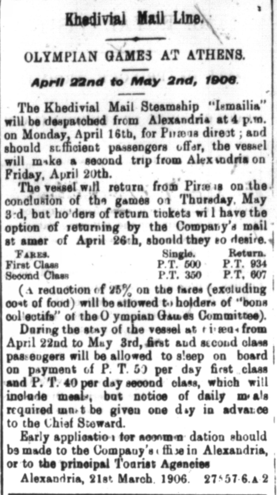

This article, found in the 1906-03-24 issue of The Egyptian Gazette, was of particular fascination due to the differences in lodging and transportation for the Olympic Games. Particularly, this was an advertisement for Khedivial Mail Lines for their steamship Ismalia,(https://en.wikipedia.org/wiki/Khedivial_Mail_S.S._Company), which was taking Egyptians to the Athens Olympic Games from Alexandria. The rates seem far cheaper than I expected, as today going to the Olympics is very expensive, due to the extensive travel worldwide. This level of travel is what has the potential to impact the 2020 Olympic Games in Tokyo by delay or even possible cancelation, as a result of the coronavirus outbreak. Compared to this advertisement, what I found most interesting was the passengers sleeping in the ship, as we have recently heard of several outbreaks on cruise ships, which would be the modern equivalent. Effectively, I wonder if concerns with such an epidemic would have been greater or lesser, as there was less travel and news took longer to travel than a quick Google search, or if it would have been greater due to a lack of modern medical practices. One thing is for sure, steamships won't be popular at the 2020 Olympics Games!

If you want to include other images, add the image file to the folder containing this file, and use this format:

