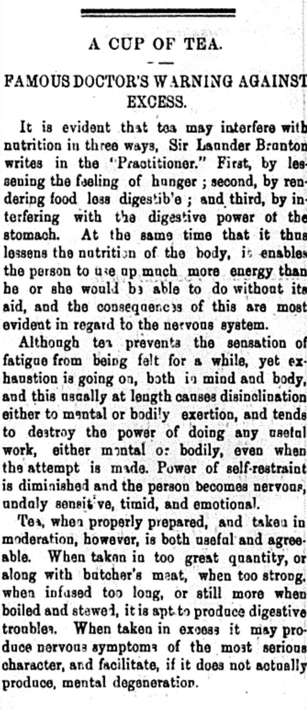

Claims from the "Famous" doctors about the effects of drinking too much tea can be quite worrying for the average consumer of tea. Sir Launder Bronton writes that tea can cause loss of appetite, and create digestion problems. Furthermore, Bronton also claims that tea in excess can produce nervous symptoms and "_mental degeneration_".
These harsh claims can definitely raise skepticism, as tea is generally understood to be safe, and people seem drink it all the time without any issues. Also, the source is over 100 years old, and there is no scientific evidence pointed to in the article.
[Food.NDTV](https://food.ndtv.com/food-drinks/5-side-effects-of-tea-that-will-compel-you-to-drop-the-cup-1746324) claims that tea will cause bloating, nutrient deficiencies, and restlessness. Because of the fact that caffeine is in tea, and caffeine is known to cause all of these problems, we can say that these claims are all valid. We now know that the doctors of Alexandria were right about a couple things, but what about the "mental degeneration" claims? In my research, [one](https://www.healthline.com/nutrition/side-effects-of-tea#3.-Poor-sleep) article pointed to the idea that tea could be related to mental issues. This was without much merit because the link was secondary, claiming the mental issues stem from sleeping problems, which is a side effect of taking too much caffeine before bed time. [Other](https://www.medicalnewstoday.com/articles/327521) articles claim that tea drinking has a positive effect on your long term mental health.
I leave it up to you to decide what to take away from this analysis, but know that while they doctors from 100 years ago couldn't get everything right, it's probable that our doctors today cannot either.

[Pink Pills: Stronger Than Death](https://dig-eg-gaz.github.io/post/2019-12-16-phuong/)
[A Look Into The History of Doan's Kidney Pills](https://dig-eg-gaz.github.io/post/2019-12-10-tryfontheophilopoulos/)

