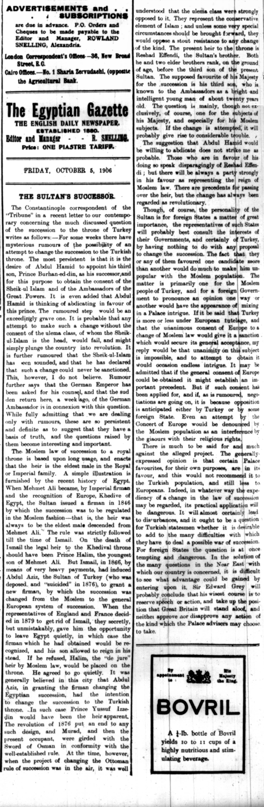

# The Sultan's Successor

It is latter part of the year 1906 in the famous Ottoman Empire whose former glory has been shying away gradually. Political and social turmoil is being brewed in the glass of succession, waiting for one push to overflow. The current sultan, Abdul Hamid II is looking to appoint his third son as his successor, Prince Burhan-ed-din. Having such a strong conviction for his decision, he is willing to abdicate the thrown to insure his succession. For such ambition, you would think the people would respect and favor such a decision, but that is the exact opposite.   
    
In the Ottoman Empire, the long-lasting Moslem law dictates who is to succeed from the previous ruler, which holds ideals that are contrary to Hamid II’s desire. The law states that the eldest male in the Royal or Imperial family is to rule. In Hamid II’s case, that would mean after him his brother Reshed Effendi is heir to the throne. The Sheik-ul-Islam and ulema, Islamic scholars, would favor the brother’s succession rather than his son because they are opposed to change. So much in fact, that if the sultan did succeed, revolution could follow.    
    
However, the religious class are not only found of resisting change but are also not found of the presence of foreign powers in their land.  The sultan’s son, out of all possible successors, is the most favored by European ambassadors. Additionally, around this time it is rumored that the German Emperor is consulting the sultan. Putting two to two together, it is not unlikely to assume the sultan having his third son succeed after him is a power play towards European favor, which is not adored by the Turkish religious class who want their sovereignty.   

## Works Cited
*[Egypt](https://www.jstor.org/stable/j.ctt7rjf4.16)    
*[Moslem Law in the Mixed Courts of Egypt](https://www.jstor.org/stable/754198)
*[The Sultan and the Khedive, 1892-1908](https://www.jstor.org/stable/4282434)    
### Related Works
*[The Sultan's Kidney Disease](https://dig-eg-gaz.github.io/post/2019-12-13-jimmymendez/)  
*[The Russian Revolution of 1905](https://dig-eg-gaz.github.io/post/2019-10-16-oscar/)  

